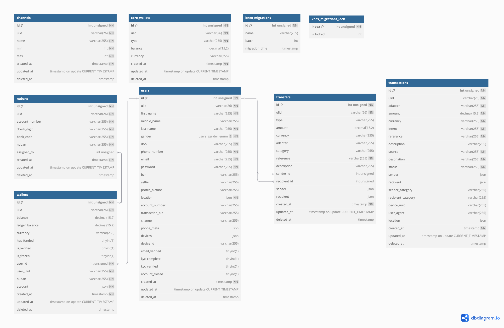

# Demo Credit

Demo Credit is a mobile lending application that provides wallet functionality for borrowers to receive loans. Wallet accounts are automatically created upon user signup, and an API call is made to Adjutor's Karma Blacklist API to verify if the user is blacklisted.

## Features

- **User Authentication**: Sign up and log in securely.
- **Profile Management**: Fetch user profile details.
- **Transaction Security**: Set a transaction PIN.
- **Wallet Management**:
  - Fetch wallet details.
  - Fund the wallet.
  - Withdraw funds.
  - Freeze or unfreeze the wallet.
  - Transfer funds to another account.
  - Core wallet management and transaction settlement
  - Multiple account channels
- **User Session Management**:
  - Track failed login attempts
  - Log out functionality.

## Tech Stack

- Node.js
- TypeScript
- Express.js
- MySQL
- Knex.js
- Redis
- Jest

## External Dependencies

- `Adjutor` - This is used to verify bad actors

## Installation

### Prerequisites

- Node.js (Latest LTS version)
- Yarn
- MySQL Database
- Redis
- Docker (optional)
- Docker Compose (optional)

### Run Locally

Ensure you have a running MySQL and Redis instance

1. Clone the repository:

   ```sh
   git clone https://github.com/victor-devv/demo-credit.git
   cd demo-credit
   ```

2. Install dependencies:

   ```sh
   yarn install
   ```

3. Configure environment variables:

   - Copy `.env.example` to `.env`
   - Provide the required values in the `.env` file

4. Compile Typescript

   ```sh
   yarn build:tsc
   ```

5. Run database migrations:

   ```sh
   yarn migrate:up
   ```

6. Start the server:
   ```sh
   yarn start:dev
   ```

### Run Using Docker Compose

Ensure you have Docker and Docker Compose installed

1. Clone the repository:

   ```sh
   git clone https://github.com/victor-devv/demo-credit.git
   cd demo-credit
   ```

2. Install dependencies:

   ```sh
   yarn install
   ```

3. Configure environment variables:

   - Copy `.env.example` to `.env`
   - Provide the required values in the `.env` file

4. Build and run the application

   ```sh
   docker-compose up --build
   ```

5. You can opt to running the server locally and run other services using Docker (comment out the api service)

## API Documentation

API endpoints and request formats can be found in the API documentation at [https://documenter.getpostman.com/view/23596345/2sAYkGJyWA](https://documenter.getpostman.com/view/23596345/2sAYkGJyWA).

## ER Diagram

[View here](https://drive.google.com/file/d/14D-fP_4Jw9kXgx8pPqbXr1Xby90giX8v/view?usp=sharing)



---

**Repository Link**: [Demo Credit](https://github.com/victor-devv/demo-credit)
